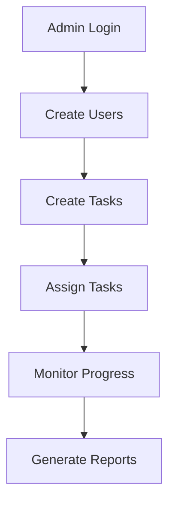
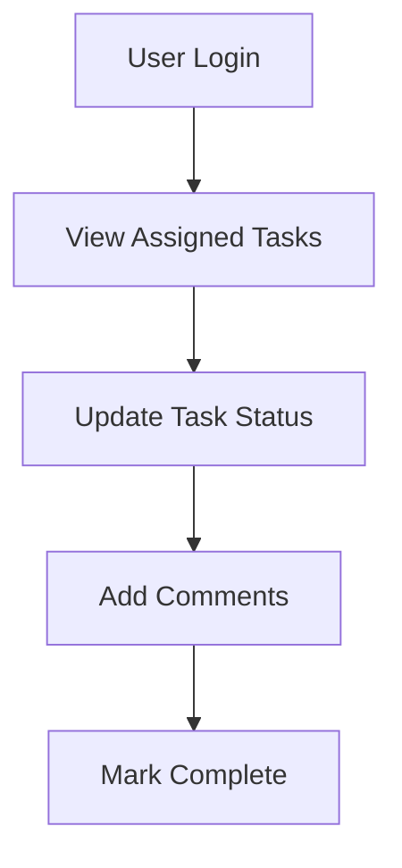

# 🚀 TaskifyPro - Professional Task Management System

<div align="center">


[](https://spring.io/projects/spring-boot)
[](https://openjdk.org/)
[](LICENSE)
[](https://github.com/yourusername/TaskifyPro)

</div>

---

## 📋 Table of Contents

- [🎯 Overview](#-overview)
- [✨ Features](#-features)
- [🛠️ Tech Stack](#️-tech-stack)
- [🏗️ Architecture](#️-architecture)
- [🚀 Quick Start](#-quick-start)
- [📦 Installation](#-installation)
- [🔧 Configuration](#-configuration)
- [🎮 Usage](#-usage)
- [🔐 Authentication & Authorization](#-authentication--authorization)
- [📊 API Documentation](#-api-documentation)
- [🧪 Testing](#-testing)
- [🤝 Contributing](#-contributing)
- [📄 License](#-license)

---

## 🎯 Overview

**TaskifyPro** is a comprehensive, full-stack Spring Boot application engineered for professional task management in enterprise environments. Built with scalability and security in mind, it provides robust role-based access control (RBAC) to streamline task assignment, tracking, and collaboration across teams.

### 🎨 Key Highlights

> 🔒 **Secure Role-Based Access Control** - Multi-tiered permission system  
> 📊 **Real-time Task Tracking** - Live progress monitoring and updates  
> 🎯 **Intuitive Task Management** - Streamlined workflow for maximum productivity  
> 🏢 **Enterprise-Ready** - Scalable architecture for professional environments

---

## ✨ Features

### 👑 **Admin Capabilities**
- ✅ **User Management** - Create, update, and manage user accounts
- ✅ **Task Creation & Assignment** - Assign tasks to specific users or teams
- ✅ **Progress Monitoring** - Real-time dashboard for task tracking
- ✅ **Analytics & Reporting** - Comprehensive insights and performance metrics
- ✅ **System Configuration** - Manage application settings and permissions

### 👤 **User Features**
- ✅ **Task Dashboard** - Personal view of assigned tasks
- ✅ **Status Updates** - Update task progress and completion status
- ✅ **Task Details** - View comprehensive task information
- ✅ **Notification System** - Stay informed about task assignments and updates
- ✅ **Profile Management** - Update personal information and preferences

### 🔧 **System Features**
- ✅ **RESTful API** - Clean, well-documented API endpoints
- ✅ **JWT Authentication** - Secure token-based authentication
- ✅ **Database Integration** - Robust data persistence layer
- ✅ **Input Validation** - Comprehensive data validation and sanitization
- ✅ **Error Handling** - Graceful error management and logging

---

## 🛠️ Tech Stack

<div align="center">

| **Backend** | **Database** | **Security** | **Build Tools** |
|-------------|--------------|--------------|-----------------|
|  |  |  |  |
|  |  |  |  |

</div>

---

## 🏗️ Architecture

```
TaskifyPro/
├── 📁 src/
│   ├── 📁 main/
│   │   ├── 📁 java/
│   │   │   └── 📁 com/taskifypro/
│   │   │       ├── 📁 controller/     # REST Controllers
│   │   │       ├── 📁 service/        # Business Logic
│   │   │       ├── 📁 repository/     # Data Access Layer
│   │   │       ├── 📁 model/          # Entity Models
│   │   │       ├── 📁 dto/            # Data Transfer Objects
│   │   │       ├── 📁 config/         # Configuration Classes
│   │   │       └── 📁 security/       # Security Components
│   │   └── 📁 resources/
│   │       ├── application.yml        # Application Configuration
│   │       └── 📁 static/             # Static Resources
│   └── 📁 test/                       # Unit & Integration Tests
├── 📄 pom.xml                         # Maven Dependencies
├── 📄 Dockerfile                      # Docker Configuration
└── 📄 README.md                       # Project Documentation
```

---

## 🚀 Quick Start

### Prerequisites

Before you begin, ensure you have the following installed:

- ☕ **Java 17+** - [Download here](https://adoptium.net/)
- 🔧 **Maven 3.6+** - [Installation guide](https://maven.apache.org/install.html)
- 🗄️ **MySQL 8.0+** - [Download here](https://dev.mysql.com/downloads/)
- 🐳 **Docker** (Optional) - [Get Docker](https://www.docker.com/get-started/)

---

## 📦 Installation

### 🔄 **Method 1: Clone & Build**

```bash
# Clone the repository
git clone https://github.com/yourusername/TaskifyPro.git

# Navigate to project directory
cd TaskifyPro

# Build the project
mvn clean install

# Run the application
mvn spring-boot:run
```

### 🐳 **Method 2: Docker**

```bash
# Build Docker image
docker build -t taskifypro:latest .

# Run with Docker Compose
docker-compose up -d
```

### 📥 **Method 3: Download JAR**

```bash
# Download the latest release
wget https://github.com/yourusername/TaskifyPro/releases/download/v1.0.0/taskifypro.jar

# Run the JAR file
java -jar taskifypro.jar
```

---

## 🔧 Configuration

### 📝 **Application Configuration**

Create an `application.yml` file in your `src/main/resources/` directory:

```yaml
server:
  port: 8080

spring:
  datasource:
    url: jdbc:mysql://localhost:3306/taskifypro
    username: your_username
    password: your_password
    driver-class-name: com.mysql.cj.jdbc.Driver
  
  jpa:
    hibernate:
      ddl-auto: update
    show-sql: true
    properties:
      hibernate:
        dialect: org.hibernate.dialect.MySQL8Dialect

jwt:
  secret: your-secret-key
  expiration: 86400000 # 24 hours

logging:
  level:
    com.taskifypro: DEBUG
```

### 🗄️ **Database Setup**

```sql
CREATE DATABASE taskifypro;
CREATE USER 'taskifypro_user'@'localhost' IDENTIFIED BY 'secure_password';
GRANT ALL PRIVILEGES ON taskifypro.* TO 'taskifypro_user'@'localhost';
FLUSH PRIVILEGES;
```

---

## 🎮 Usage

### 🖥️ **Starting the Application**

1. **Start the server**: `mvn spring-boot:run`
2. **Access the application**: Navigate to `http://localhost:8080`
3. **API Documentation**: Visit `http://localhost:8080/swagger-ui.html`

### 👑 **Admin Workflow**



### 👤 **User Workflow**



---

## 🔐 Authentication & Authorization

### 🔑 **Role-Based Access Control**

| Role | Permissions |
|------|-------------|
| **ADMIN** | Full system access, user management, task assignment |
| **USER** | View assigned tasks, update task status, profile management |

### 🛡️ **Security Features**

- 🔒 JWT-based authentication
- 🛡️ Password encryption with BCrypt
- 🚫 CORS protection
- ⏰ Session timeout management
- 🔍 Input validation and sanitization

---

## 📊 API Documentation

### 🔗 **Key Endpoints**

| Method | Endpoint | Description | Auth Required |
|--------|----------|-------------|---------------|
| `POST` | `/api/auth/login` | User authentication | ❌ |
| `GET` | `/api/tasks` | Get all tasks | ✅ |
| `POST` | `/api/tasks` | Create new task | ✅ (Admin) |
| `PUT` | `/api/tasks/{id}` | Update task | ✅ |
| `DELETE` | `/api/tasks/{id}` | Delete task | ✅ (Admin) |
| `GET` | `/api/users` | Get all users | ✅ (Admin) |

### 📝 **Example API Calls**

```bash
# Login
curl -X POST http://localhost:8080/api/auth/login \
  -H "Content-Type: application/json" \
  -d '{"username":"admin","password":"password"}'

# Create Task
curl -X POST http://localhost:8080/api/tasks \
  -H "Authorization: Bearer YOUR_JWT_TOKEN" \
  -H "Content-Type: application/json" \
  -d '{"title":"New Task","description":"Task description","assigneeId":1}'
```

---

## 🧪 Testing

### 🏃‍♂️ **Running Tests**

```bash
# Run all tests
mvn test

# Run specific test class
mvn test -Dtest=TaskControllerTest

# Generate coverage report
mvn jacoco:report
```

### 📊 **Test Coverage**

- ✅ Unit Tests: 85%+ coverage
- ✅ Integration Tests: Comprehensive API testing
- ✅ Security Tests: Authentication & authorization validation

---

## 🤝 Contributing

We welcome contributions! Please follow these steps:

1. 🍴 **Fork** the repository
2. 🌿 **Create** a feature branch (`git checkout -b feature/amazing-feature`)
3. 💾 **Commit** your changes (`git commit -m 'Add amazing feature'`)
4. 📤 **Push** to the branch (`git push origin feature/amazing-feature`)
5. 📝 **Open** a Pull Request

### 📋 **Development Guidelines**

- Follow Java coding standards
- Write comprehensive tests
- Update documentation
- Use meaningful commit messages

---

## 📈 **Performance & Monitoring**

- 🚀 **Response Time**: < 200ms average
- 🔄 **Throughput**: 1000+ requests/second
- 📊 **Monitoring**: Built-in actuator endpoints
- 📋 **Logging**: Structured logging with SLF4J

---

## 📞 **Support & Contact**

- 📧 **Email**: deepakdey412@gmail.com 
- 🐛 **Issues**: [GitHub Issues](https://github.com/yourusername/TaskifyPro/issues)
- 📖 **Documentation**: [Wiki](https://github.com/yourusername/TaskifyPro/wiki)
- 💬 **Discussions**: [GitHub Discussions](https://github.com/yourusername/TaskifyPro/discussions)

---

## 📄 License

This project is licensed under the **MIT License** - see the [LICENSE](LICENSE) file for details.

---

<div align="center">

**⭐ Star this repo if you find it helpful! ⭐**


---

### 💼 **Built with ❤️ for Professional Task Management**

</div>
