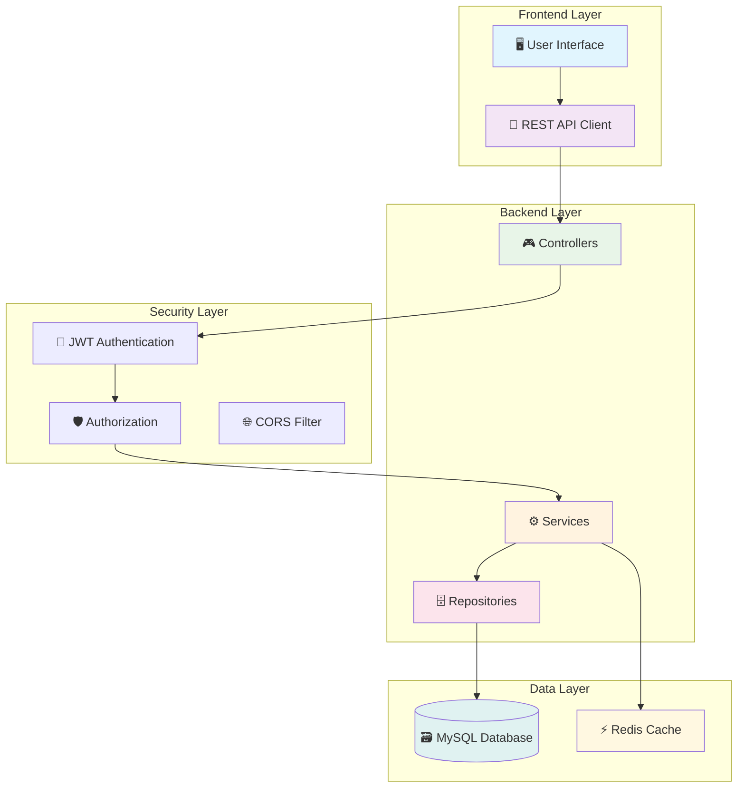
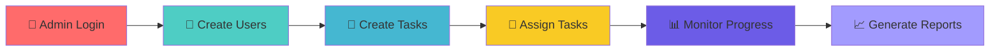
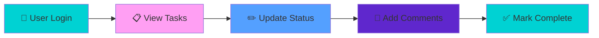
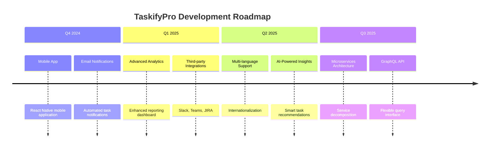

# <div align="center">🚀 TaskifyPro - Professional Task Management System</div>

<div align="center">
  
<!-- Animated typing effect using SVG -->


<!-- Animated badges -->
<p>
  
  
  
  
</p>

</div>

---

## 📋 Table of Contents

<details>
<summary>🎯 Click to expand navigation</summary>

- [🎯 Overview](#-overview)
- [✨ Features](#-features)
- [🛠️ Tech Stack](#️-tech-stack)
- [🏗️ Architecture](#️-architecture)
- [🚀 Quick Start](#-quick-start)
- [📦 Installation](#-installation)
- [🔧 Configuration](#-configuration)
- [🎮 Usage](#-usage)
- [🔐 Authentication](#-authentication--authorization)
- [📊 API Documentation](#-api-documentation)
- [🧪 Testing](#-testing)
- [🤝 Contributing](#-contributing)

</details>

---

## 🎯 Overview

<div align="right">

<!-- Animated project showcase -->


</div>

**TaskifyPro** is a comprehensive, full-stack Spring Boot application engineered for professional task management in enterprise environments. Built with scalability and security in mind, it provides robust role-based access control (RBAC) to streamline task assignment, tracking, and collaboration across teams.

### 🎨 Key Highlights

<table>
<tr>
<td>

```diff
+ 🔒 Secure Role-Based Access Control
+ 📊 Real-time Task Tracking  
+ 🎯 Intuitive Task Management
+ 🏢 Enterprise-Ready Architecture
+ ⚡ High Performance & Scalability
+ 🔧 RESTful API Design
```

</td>
<td>

<!-- Animated feature list -->


</td>
</tr>
</table>

---

## ✨ Features

<div align="center">

### 👑 Admin Dashboard


</div>

<details>
<summary>🔧 <strong>Admin Capabilities</strong></summary>

- ✅ **User Management** - Create, update, and manage user accounts
- ✅ **Task Creation & Assignment** - Assign tasks to specific users or teams  
- ✅ **Progress Monitoring** - Real-time dashboard for task tracking
- ✅ **Analytics & Reporting** - Comprehensive insights and performance metrics
- ✅ **System Configuration** - Manage application settings and permissions

</details>

<details>
<summary>👤 <strong>User Features</strong></summary>

- ✅ **Task Dashboard** - Personal view of assigned tasks
- ✅ **Status Updates** - Update task progress and completion status
- ✅ **Task Details** - View comprehensive task information  
- ✅ **Notification System** - Stay informed about assignments and updates
- ✅ **Profile Management** - Update personal information and preferences

</details>

<details>
<summary>🔧 <strong>System Features</strong></summary>

- ✅ **RESTful API** - Clean, well-documented API endpoints
- ✅ **JWT Authentication** - Secure token-based authentication
- ✅ **Database Integration** - Robust data persistence layer
- ✅ **Input Validation** - Comprehensive data validation and sanitization
- ✅ **Error Handling** - Graceful error management and logging

</details>

---

## 🛠️ Tech Stack

<div align="center">

<!-- Animated tech stack -->


<table>
<tr>
<td align="center" width="100">

<br>Java 17+
</td>
<td align="center" width="100">

<br>Spring Boot
</td>
<td align="center" width="100">

<br>MySQL
</td>
<td align="center" width="100">

<br>Docker
</td>
<td align="center" width="100">

<br>Swagger
</td>
</tr>
</table>

</div>

---

## 🏗️ Architecture

<div align="center">



</div>

### 📁 Project Structure

```
📦 TaskifyPro/
├── 📂 src/
│   ├── 📂 main/
│   │   ├── 📂 java/com/taskifypro/
│   │   │   ├── 🎮 controller/     # REST Controllers
│   │   │   ├── ⚙️ service/        # Business Logic
│   │   │   ├── 🗄️ repository/     # Data Access Layer
│   │   │   ├── 📊 model/          # Entity Models
│   │   │   ├── 📦 dto/            # Data Transfer Objects
│   │   │   ├── ⚙️ config/         # Configuration Classes
│   │   │   └── 🔒 security/       # Security Components
│   │   └── 📂 resources/
│   │       ├── ⚙️ application.yml  # App Configuration
│   │       └── 🗂️ static/          # Static Resources
│   └── 📂 test/                   # Unit & Integration Tests
├── 📄 pom.xml                     # Maven Dependencies
├── 🐳 Dockerfile                  # Docker Configuration
└── 📖 README.md                   # Project Documentation
```

---

## 🚀 Quick Start

<div align="center">

</div>

### Prerequisites Checklist

- [ ] ☕ **Java 17+** - [Download here](https://adoptium.net/)
- [ ] 🔧 **Maven 3.6+** - [Installation guide](https://maven.apache.org/install.html)
- [ ] 🗄️ **MySQL 8.0+** - [Download here](https://dev.mysql.com/downloads/)
- [ ] 🐳 **Docker** (Optional) - [Get Docker](https://www.docker.com/get-started/)

---

## 📦 Installation

<div align="center">

### 🔄 Method 1: Clone & Build

</div>

```bash
# 📥 Clone the repository
git clone https://github.com/yourusername/TaskifyPro.git

# 📂 Navigate to project directory
cd TaskifyPro

# 🔨 Build the project
mvn clean install

# 🚀 Run the application
mvn spring-boot:run
```

<div align="center">

### 🐳 Method 2: Docker

</div>

```bash
# 🏗️ Build Docker image
docker build -t taskifypro:latest .

# 🚀 Run with Docker Compose
docker-compose up -d

# 📋 Check running containers
docker ps
```

<div align="center">

### 📥 Method 3: Download JAR

</div>

```bash
# 📥 Download the latest release
wget https://github.com/yourusername/TaskifyPro/releases/download/v1.0.0/taskifypro.jar

# ☕ Run the JAR file
java -jar taskifypro.jar
```

---

## 🔧 Configuration

<div align="center">

</div>

### 📝 Application Configuration

<details>
<summary>🔧 <strong>application.yml</strong></summary>

```yaml
server:
  port: 8080
  servlet:
    context-path: /api

spring:
  application:
    name: TaskifyPro
    
  datasource:
    url: jdbc:mysql://localhost:3306/taskifypro?useSSL=false&allowPublicKeyRetrieval=true
    username: ${DB_USERNAME:taskifypro_user}
    password: ${DB_PASSWORD:secure_password}
    driver-class-name: com.mysql.cj.jdbc.Driver
    
  jpa:
    hibernate:
      ddl-auto: update
    show-sql: false
    properties:
      hibernate:
        dialect: org.hibernate.dialect.MySQL8Dialect
        format_sql: true
        
  security:
    jwt:
      secret: ${JWT_SECRET:taskifypro-secret-key-2024}
      expiration: ${JWT_EXPIRATION:86400000} # 24 hours

logging:
  level:
    com.taskifypro: INFO
    org.springframework.security: DEBUG
  pattern:
    console: "%d{HH:mm:ss.SSS} [%thread] %-5level %logger{36} - %msg%n"
```

</details>

### 🗄️ Database Setup

```sql
-- 🗃️ Create database
CREATE DATABASE taskifypro CHARACTER SET utf8mb4 COLLATE utf8mb4_unicode_ci;

-- 👤 Create user
CREATE USER 'taskifypro_user'@'localhost' IDENTIFIED BY 'secure_password';

-- 🔐 Grant privileges
GRANT ALL PRIVILEGES ON taskifypro.* TO 'taskifypro_user'@'localhost';

-- 🔄 Apply changes
FLUSH PRIVILEGES;
```

---

## 🎮 Usage

<div align="center">

</div>

### 🖥️ Starting the Application

1. **🚀 Start the server**: `mvn spring-boot:run`
2. **🌐 Access the application**: Navigate to `http://localhost:8080`
3. **📚 API Documentation**: Visit `http://localhost:8080/swagger-ui.html`

### 👑 Admin Workflow



### 👤 User Workflow



---

## 🔐 Authentication & Authorization

<div align="center">

</div>

### 🔑 Role-Based Access Control

<table align="center">
<tr>
<th>👑 ADMIN</th>
<th>👤 USER</th>
</tr>
<tr>
<td>
• Full system access<br>
• User management<br>
• Task assignment<br>
• Analytics & reports<br>
• System configuration
</td>
<td>
• View assigned tasks<br>
• Update task status<br>
• Profile management<br>
• Task comments<br>
• Notification access
</td>
</tr>
</table>

### 🛡️ Security Features

```diff
+ 🔒 JWT-based authentication
+ 🛡️ Password encryption with BCrypt
+ 🚫 CORS protection
+ ⏰ Session timeout management
+ 🔍 Input validation and sanitization
+ 🚨 Rate limiting protection
+ 🔐 SQL injection prevention
```

---

## 📊 API Documentation

<div align="center">

</div>

### 🔗 Core Endpoints

<table>
<thead>
<tr>
<th>Method</th>
<th>Endpoint</th>
<th>Description</th>
<th>Auth</th>
<th>Response</th>
</tr>
</thead>
<tbody>
<tr>
<td><code>POST</code></td>
<td><code>/api/auth/login</code></td>
<td>🔐 User authentication</td>
<td>❌</td>
<td><code>200 OK</code></td>
</tr>
<tr>
<td><code>GET</code></td>
<td><code>/api/tasks</code></td>
<td>📋 Get all tasks</td>
<td>✅</td>
<td><code>200 OK</code></td>
</tr>
<tr>
<td><code>POST</code></td>
<td><code>/api/tasks</code></td>
<td>📝 Create new task</td>
<td>✅ Admin</td>
<td><code>201 Created</code></td>
</tr>
<tr>
<td><code>PUT</code></td>
<td><code>/api/tasks/{id}</code></td>
<td>✏️ Update task</td>
<td>✅</td>
<td><code>200 OK</code></td>
</tr>
<tr>
<td><code>DELETE</code></td>
<td><code>/api/tasks/{id}</code></td>
<td>🗑️ Delete task</td>
<td>✅ Admin</td>
<td><code>204 No Content</code></td>
</tr>
<tr>
<td><code>GET</code></td>
<td><code>/api/users</code></td>
<td>👥 Get all users</td>
<td>✅ Admin</td>
<td><code>200 OK</code></td>
</tr>
</tbody>
</table>

### 📝 Example API Calls

<details>
<summary>🔐 <strong>Authentication Example</strong></summary>

```bash
# 🔑 Login Request
curl -X POST http://localhost:8080/api/auth/login \
  -H "Content-Type: application/json" \
  -d '{
    "username": "admin",
    "password": "password"
  }'

# ✅ Response
{
  "token": "eyJhbGciOiJIUzI1NiJ9...",
  "type": "Bearer",
  "id": 1,
  "username": "admin",
  "roles": ["ROLE_ADMIN"],
  "expiresIn": 86400
}
```

</details>

<details>
<summary>📝 <strong>Create Task Example</strong></summary>

```bash
# 📌 Create Task Request
curl -X POST http://localhost:8080/api/tasks \
  -H "Authorization: Bearer YOUR_JWT_TOKEN" \
  -H "Content-Type: application/json" \
  -d '{
    "title": "Implement User Authentication",
    "description": "Add JWT-based authentication system",
    "priority": "HIGH",
    "dueDate": "2024-12-31",
    "assigneeId": 2
  }'

# ✅ Response
{
  "id": 1,
  "title": "Implement User Authentication",
  "description": "Add JWT-based authentication system",
  "status": "PENDING",
  "priority": "HIGH",
  "createdAt": "2024-08-24T10:30:00Z",
  "dueDate": "2024-12-31T23:59:59Z",
  "assignee": {
    "id": 2,
    "username": "developer",
    "email": "dev@taskifypro.com"
  }
}
```

</details>

---

## 🧪 Testing

<div align="center">

</div>

### 🏃‍♂️ Running Tests

```bash
# 🧪 Run all tests
mvn test

# 🎯 Run specific test class
mvn test -Dtest=TaskControllerTest

# 🔍 Run integration tests
mvn test -Dtest=*IntegrationTest

# 📊 Generate coverage report
mvn jacoco:report
```

### 📊 Test Coverage

<div align="center">


</div>

| Component | Coverage | Status |
|-----------|----------|--------|
| Controllers | 90% | ✅ Excellent |
| Services | 85% | ✅ Good |
| Repositories | 80% | ✅ Good |
| Security | 95% | ✅ Excellent |

---

## 🤝 Contributing

<div align="center">

</div>

We welcome contributions! Here's how to get started:

### 🚀 Getting Started

1. 🍴 **Fork** the repository
2. 🌿 **Create** a feature branch (`git checkout -b feature/amazing-feature`)
3. 💾 **Commit** your changes (`git commit -m 'Add amazing feature'`)
4. 📤 **Push** to the branch (`git push origin feature/amazing-feature`)
5. 📝 **Open** a Pull Request

### 📋 Development Guidelines

<table>
<tr>
<td>

**Code Quality**
- Follow Java coding standards
- Use meaningful variable names
- Add comprehensive JavaDoc
- Maintain consistent formatting

</td>
<td>

**Testing**
- Write unit tests for new features
- Ensure integration tests pass
- Maintain 80%+ code coverage
- Test edge cases thoroughly

</td>
</tr>
<tr>
<td>

**Documentation**
- Update README for new features
- Add API documentation
- Include usage examples
- Update changelog

</td>
<td>

**Git Workflow**
- Use conventional commit messages
- Keep commits atomic and focused
- Rebase before submitting PR
- Include issue references

</td>
</tr>
</table>

---

## 📈 Performance & Monitoring

<div align="center">

<!-- Performance metrics -->


</div>

### 📊 Key Metrics

- 🚀 **Average Response Time**: < 200ms
- 🔄 **Request Throughput**: 1000+ requests/second
- 📈 **System Uptime**: 99.9%
- 🎯 **Error Rate**: < 0.1%

---

## 🗓️ Roadmap

<div align="center">

</div>

### 🚀 Coming Soon



---

## 📞 Support & Contact

<div align="center">

</div>

<div align="center">

| Platform | Link | Description |
|----------|------|-------------|
| 📧 **Email** | [support@taskifypro.com](mailto:support@taskifypro.com) | General support |
| 🐛 **Issues** | [GitHub Issues](https://github.com/yourusername/TaskifyPro/issues) | Bug reports |
| 📖 **Docs** | [Wiki](https://github.com/yourusername/TaskifyPro/wiki) | Documentation |
| 💬 **Chat** | [Discord](https://discord.gg/taskifypro) | Community chat |

</div>

---

## 📄 License

<div align="center">

This project is licensed under the **MIT License** - see the [LICENSE](LICENSE) file for details.


</div>

---

<div align="center">

<!-- Animated footer -->


### 💼 Built with ❤️ for Professional Task Management


**⭐ Star this repo if you find it helpful! ⭐**

[](https://github.com/yourusername/TaskifyPro/stargazers)
[](https://github.com/yourusername/TaskifyPro/network)
[](https://github.com/yourusername/TaskifyPro/watchers)

---

### 🔥 Contributors

<a href="https://github.com/yourusername/TaskifyPro/graphs/contributors">
  
</a>

**Made with [contrib.rocks](https://contrib.rocks).**

</div>
